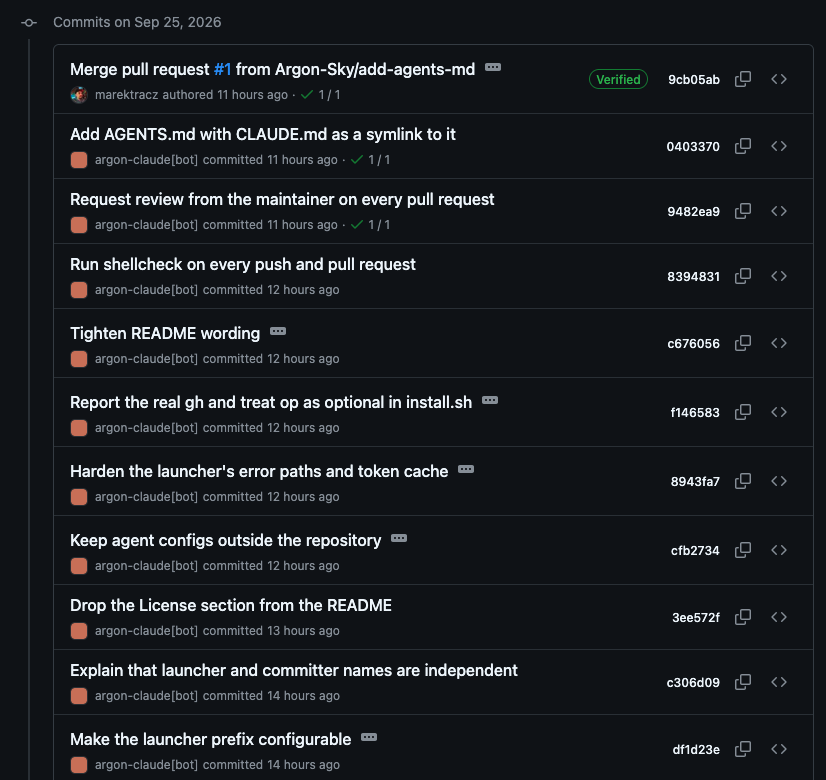

<div align="center">
  <picture>
    <source media="(prefers-color-scheme: dark)" srcset="docs/logo-dark.svg">
    <source media="(prefers-color-scheme: light)" srcset="docs/logo-light.svg">
    
  </picture>
</div>

<div align="center">
  <h3>Give each coding agent its own GitHub identity</h3>
</div>

<div align="center">
  <a href="LICENSE"></a>
  
</div>

<br>

Agent Identity Launcher is a small wrapper that starts your coding agent (Claude Code, Codex, OpenCode, …) under its own GitHub App identity.

Your coding agents commit as you, push with your keys, and can reach every repository you can. Give each one its own GitHub identity instead.

```bash
argon-claude     # instead of claude
```

Claude Code starts as usual, but every commit is authored by the agent's own bot, here `argon-claude[bot]`, and `git` and `gh` authenticate with an hour-long token that belongs to the agent, not to you. The same goes for Codex, OpenCode, or any other CLI agent: one launcher each, one identity each.

- **Know who wrote what.** Every commit and pull request links to the agent that made it.
- **Least privilege.** Each agent sees only the repositories and permissions you grant it.
- **Nothing long-lived in the session.** Tokens expire after an hour and are minted on demand; the private key stays in 1Password.
- **Revoke one agent, not yourself.** Suspend or delete an agent's app; your own access and the other agents are untouched.

This repository's own history, written by Claude Code through the launcher:



No daemon, no server, no changes to your `~/.gitconfig`, SSH keys, or `gh` login: one bash script and one small config file per agent. Plain `claude` keeps working as you.

## How it works

Each agent gets a [GitHub App](https://docs.github.com/en/apps), which is GitHub's supported way to give software its own identity. (A machine user per agent isn't: GitHub's terms allow one per person. A personal access token would still be you.)

```text
argon-claude
  1. reads ~/.config/argon-agents/claude.env  App ID, private key reference, command
  2. signs a JWT with the app's private key   proves "I am this GitHub App"
  3. exchanges it for an installation token   valid 1 hour, cached until 5 min before expiry
  4. sets the environment for this process    bot author/committer, git credential helper, gh shim
  5. execs claude
       ├─ git push → credential helper → cached or fresh token
       └─ gh …     → gh shim           → cached or fresh token
```

Git is configured through `GIT_CONFIG_*` environment variables only: inherited credential helpers (such as macOS `osxkeychain`) are cleared, and `git@github.com:` remotes are rewritten to HTTPS, because installation tokens don't work over SSH. Since `git` and `gh` ask for a token on every use, sessions longer than an hour keep working.

**Not a sandbox.** The agent still runs as your user and could deliberately use your SSH key. This prevents an agent from *accidentally* acting as you; it doesn't stop a malicious one.

## Setup

Requirements: macOS (Linux untested), git ≥ 2.31, curl, OpenSSL 3, jq, `gh`, bash ≥ 3.2; optionally the 1Password CLI (`op`).

**1. Create a GitHub App per agent** on the account that owns your repositories (Settings → Developer settings → GitHub Apps → New GitHub App):

| Field | Value |
|---|---|
| Name | Unique across GitHub, e.g. `<you>-claude`; the bot appears as `<you>-claude[bot]` |
| Homepage URL | Anything, e.g. your GitHub profile |
| Webhook | Uncheck **Active** |
| Repository permissions | **Contents** and **Pull requests**: Read and write. Add **Workflows** only if the agent may edit `.github/workflows/`. |
| Installable on | **Only on this account** |

Then note the **App ID**, generate a **private key**, and use **Install App** to install it on the repositories the agent may access.

**2. Store the private key.** Either in 1Password, and check that `op read "op://…/private key" | openssl pkey -noout` works (the CLI must be connected to the desktop app: Settings → Developer → Integrate with 1Password CLI), or as a file outside this repository with `chmod 600`.

**3. Configure and install:**

```bash
git clone https://github.com/Argon-Sky/agent-identity-launcher.git && cd agent-identity-launcher
mkdir -p ~/.config/argon-agents
cp examples/agent.env ~/.config/argon-agents/claude.env   # set ARGON_APP_ID, ARGON_KEY_REF, ARGON_COMMAND
./install.sh                                              # links into ~/.local/bin; safe to re-run; add --prefix my- for my-claude
argon-agent check claude                                  # should end with "identity: consistent"
```

Configs live in `~/.config/argon-agents`, outside the clone, so updating or moving the repository never touches them. Make sure `~/.local/bin` is on your `PATH`. The command you type and the name GitHub shows are set in different places, and neither depends on the other:

| Name | Set by | Example |
|---|---|---|
| Launcher (what you type) | The prefix (`argon-` unless you pass `./install.sh --prefix`) plus the config file name | `claude.env` → `argon-claude`, or `my-claude` with `--prefix my-` |
| Committer on GitHub | The GitHub App's name from step 1 | App `<you>-claude` → `<you>-claude[bot]` |

Matching them is only a convenience. In the author's setup `argon-claude` commits as `argon-claude[bot]`, but `argon-cmd` (from `cmd.env`) commits as `argon-command-code[bot]`.

**4. Turn off the agent's own attribution.** Claude Code adds `Co-Authored-By: Claude …` to commits, so GitHub shows `claude` as a second author next to the bot. Turn it off in `~/.claude/settings.json` (all sessions):

```json
{ "attribution": { "commit": "", "pr": "", "sessionUrl": false } }
```

or only for the launcher: `ARGON_COMMAND=(claude --settings '{"attribution":{"commit":"","pr":"","sessionUrl":false}}')`. Other agents have their own switches, if any.

## Usage

```bash
<prefix><agent> [args...]     # e.g. argon-claude: run the agent under its identity; arguments are passed through
argon-agent check <agent>     # test the identity without starting the agent
argon-agent token <agent>     # print a valid installation token
```

To add or rename an agent, add or rename its config, then re-run `./install.sh` (or change the prefix with `./install.sh --prefix …`); old launchers are removed. To change the committer name, rename the GitHub App (then `rm -rf ~/.cache/argon-agents`). To rotate a key, generate a new one on the app's page, replace it, run `check`, then delete the old one.

## Troubleshooting

| Symptom | Fix |
|---|---|
| Commits show your personal name | The agent was started as `claude`, not through its launcher (`argon-claude`). |
| `could not read the private key from 1Password` | Run `op account list`; if empty, connect the CLI to the desktop app. Re-copy the secret reference. |
| `GitHub rejected app …` | Wrong App ID or key, or the clock is off. |
| `app … has N installations` | Set `ARGON_OWNER` in the agent's config. |
| `gh in zsh: WARNING` | A shell startup file prepends another `gh` before the shim; make it append to `PATH` instead. |
| Anything stale | `rm -rf ~/.cache/argon-agents "$TMPDIR/argon-agents-$(id -u)"` |
